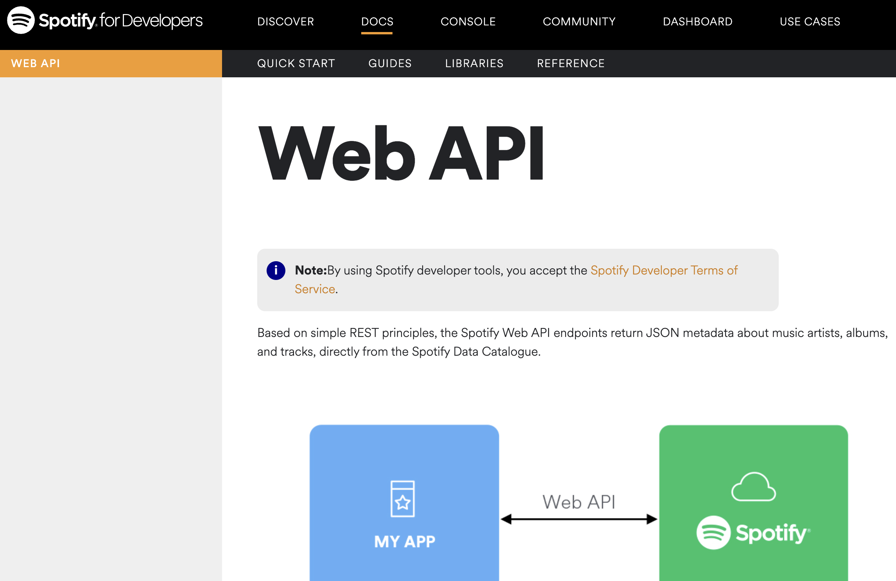

# My Blog v2
##### Hello! This is a new implementation of a previous project of mine about a personal blog. My Blog 2 has two more routes called Saved Tracks & Music Search. This crazy and novel routes provide you with secret access to my Spotify Account & Spotify database in general. Through this project, I understood how web applications work and the advantage of using developer tools online which in this case is Spotify for Developers

Tools: flask, python, Spotify WEB API
___
Images:
---

___
## Steps:

To-do:
#### Week 1:
* search travel apps
* question your project

#### Week 2:
* search database creation and manipulation
* question your project

#### Week 3:
* go through Spotify Web API tutorial
* watch youtube
* watch some more youtube
* consult professor Salu

#### Week 4:
* happily combine your website with Spotify Web API
* learn how to use libraries with Spotipy library
* learn how to improve from others' github projects
* present your project

As well as improving in Python, I learned how to manage projects and how to reach to right people through this class.

# My Blog v1
#### Video Demo:  <https://youtu.be/y-fa9JQA7ho>
#### Hello! The website I have built using python, HTML, css and jinja is all about your hobbies. In fact, it is about reading and watching. So in your special blog that you can register with an username and a password, you get 4 sections to blog the books you read, the books you wanna read, the movies you watched, and the movies you wanna watch :) Amazing right? You will not only be able to keep track of your hobbies, but also have a list under your hand when choosing a new book/movie!
## Let's see what each of the file does
### Static Folder
#### In this folder we have two files: popcorn.svg and styles.css Popcorn.svg is that little image of popcorn displaying on the website's tab. Styles.css folder, on the other hand, is the file containing all our css code conserning design. In this file, I chose to built a website with a similar design to CS50 Finance since i wanted simplicity. So the css in there establishes exactly that. I also definied colors using the specific rgb numbers so that I have the exact color I want.
### Templates Folder
#### In this folder, we have several html files. These files serve to tell the  omputer what to display everytime that link they refer to is called. For example, login.html is concerned with displaying the login input, loggin button and also decides what to display with different methods(post or get) when the user calls "/login". Same goes for others; hi.html contains the etzt displayed on homepage; movies, book, wished_movies, and wished_books have input spaces and lists the previous input values under the input button. But in books, movies, wished_books, wished_movies, the situation changes a bit. There I used html to use the variable from application.py to build a dinamic list.
### Project Folder
#### Last but not least, in our main folder we have our application.py, project.db, helpers.py, requirements.txt files. Application.py is the file where the backend of our website runs. In Python, I wrote the computer instructions to handle each section of the website. Using if else statements to differ the direction of each function, the function reacts different when called by different methods(post-get). In project.db, I created 5 tables: one for users and the other for each of the hobby they input about. In these tables are the datas of each user stored and called when needed in application.py duch as user_id and book_name.
## Thanks for Reading! Hope it was useful and understandable :)
# This was My Blog